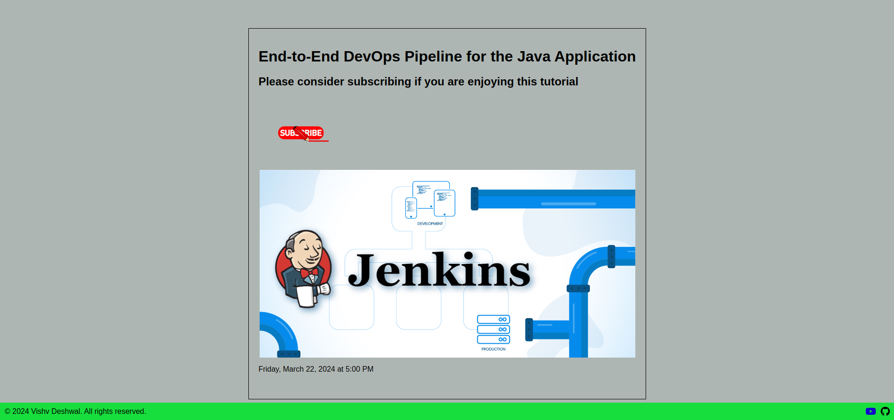

# Sample application for Java using Maven
### Complete CI/CD project of Java Application build from raw code and deployment onto the production server. This project helped me learn a lots of things that needs to be kept in mind while putting a raw code onto the production server.
# Java Application


- This Application is build by Maven reading pom.xml file
- It uses Jenkins as the CI/CD pipeline to render code into a functioning application
- GitOps tools like ArgoCD is used to deploy the application on cloud
- AWS Cloud is used to run our application
- EKS cluster is used to manage the Docker containers of our application
- Ingress Services with Load balancer of AWS is used to publicly expose the application to the users.


---
---

# Steps to Follow
1.  Setting Up a Jenkins Server and configuring our setup
2.  Provisioning the EKS Cluster 
3. Configuring our Setup
---
# 1. Jenkins Server Setup
- Provision an EC2 instance of t3.medium type, which has enough amount of compute and memory to support our project. 
- Keep it in mind that this instance is not free-tier, make sure it will cost you slightly.
-  You can use the user data input or shell script to install the necessary configuration on the system.


   #### Run these commands either as Shell script or as user data to configure your Jenkins Server.
```bash
#!/bin/bash
sudo apt update -y
sudo apt install openjdk-17-jre -y
sudo apt install openjdk-17-jdk -y
java --version

# Installing Jenkins
curl -fsSL https://pkg.jenkins.io/debian/jenkins.io-2023.key | sudo tee \
  /usr/share/keyrings/jenkins-keyring.asc > /dev/null
echo deb [signed-by=/usr/share/keyrings/jenkins-keyring.asc] \
  https://pkg.jenkins.io/debian binary/ | sudo tee \
  /etc/apt/sources.list.d/jenkins.list > /dev/null
sudo apt-get update -y
sudo apt-get install jenkins -y

# Installing Docker 
sudo apt update
sudo apt install docker.io -y
sudo usermod -aG docker jenkins
sudo usermod -aG docker ubuntu
sudo systemctl restart docker
sudo chmod 777 /var/run/docker.sock


# Run Docker Container of Sonarqube
docker run -d  --name sonar -p 9000:9000 sonarqube:lts-community
```
- This will configure your Jenkins server to get your code from Repo to Application server
- Plugins to be installed--
    1. SonarQube
    2. Docker
    3. Jdk
---


# 2. Provisioning EKS Cluster
- We can choose either fargate or simple Node group cluster.
```
eksctl create cluster --region ap-south-1 --name my-cluster-name
```
- This will provision your minimum infrastructure on the AWS so that you can run your application on cloud.
```
aws eks --region update-kubeconfig --name my-cluster-name
```
- This will configure your CLI to be used directly to control the EKS cluster.
- Install the ArgoCD gitOps tool to fetch changes from your updated deployment file at the end.
```
curl -fsSL -o get_helm.sh https://raw.githubusercontent.com/helm/helm/main/scripts/get-helm-3

chmod 700 get_helm.sh

./get_helm.sh

helm repo add argo https://argoproj.github.io/argo-helm

helm install argocd argo/argo-cd
```
- This will install the helm and the ArgoCD application.
- Wait for all the pods to be provisioned

```
kubectl port-forward svc/argocd-server 8080:443
```
- Login credentials of argoCD will be
    1. user name: admin
    2. Password: 
    ```
    kubectl get secrets argocd-initial-admin-secret -o jsonpath='{.data.password}'| base64 -d    
    ```
- You can access the ArgoCd application by accessing this [argoCD](http://localhost:8080)
- Add new project and add the repository of your deployment.yaml file where you will store the updated image name of your docker image.

### Installing Ingress Controller 
- This will provision the Ingress Controller and Load Balancer type service so that our application can be accessed with a DNS name or CNAME configured with the Load Balancer.
- We will use helm charts to provision it once again.
```
helm repo add ingress-nginx https://kubernetes.github.io/ingress-nginx
helm install ingress-nginx ingress-nginx/ingress-nginx
```
- This command will provision your ingress controller, but you'll still need to write down the ingress rules which are listened by the controller.


# 3. Configuring Pipeline
- Ensure the connectivity with your sonar server is done and the other plugins are installed in your Jenkins Server.
- Tools are configured like JDK17, Maven3, Docker.
- Use declarative pipeline which has all the code inside of the repository along with your Jenkins file.
- Then make another build that will update the deployment.yaml file which is present in a different repository to loosely couple our one code into different parts.


## Links
[](https://www.linkedin.com/in/vishv-deshwal-2a57a0227/)